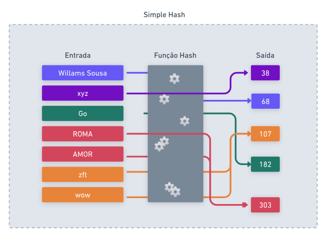

# Hashing e SHA-256

## Introdução
Funções hash são operações matemáticas que transformam uma entrada de qualquer tamanho em uma saída de tamanho fixo. Para uma mesma entrada, a saída gerada será sempre a mesma.

Uma das principais propriedades das funções hash é que a operação é irreversível, ou seja, não é possível obter a entrada original a partir da saída gerada.

Além disso, o tamanho da saída é sempre fixo, independentemente do tamanho da entrada. Isso significa que uma entrada curta e uma entrada muito longa geram um hash com a mesma quantidade de bits.

Embora seja esperado que entradas diferentes gerem hashes diferentes, existe a possibilidade de colisões, onde duas entradas distintas podem produzir o mesmo hash. A qualidade da função hash está diretamente ligada à sua capacidade de minimizar essas colisões.

Para começar, vamos criar uma função hash simples e passar por todos os pontos mencionados acima. Nossa função hash vai fazer o seguinte: dada uma entrada, somamos os valores ASCII da entrada e dessa soma obtemos o módulo 256, ou seja, teremos sempre um valor entre 0 e 255 não importando o tamanho da entrada. Acompanhe:

```go
package main

import (
    "fmt"
)

func simpleHash(in string) int {
    hash := 0
    for _, char := range in {
        hash += int(char)
    }
    return hash % 256
}

func main() {
	input1 := "willams sousa"
	input2 := "Go"
	input3 := "xyz"

    fmt.Printf("Hash de '%v':%v\n", input1, simpleHash(input1))
    fmt.Printf("Hash de '%v':%v\n", input2, simpleHash(input2))
    fmt.Printf("Hash de '%v':%v\n", input3, simpleHash(input3))
}
```
Nosso simpleHash tem apenas 256 saídas possíveis, mas pode processar infinitas entradas distintas. Isso inevitavelmente leva a colisões, pois, pelo Princípio da Pomba (Pigeonhole Principle), há mais entradas possíveis do que saídas distintas.


Por exemplo, todo palíndromo leva a colisões, pois a soma é uma operação comutativa, e a soma dos códigos ASCII dessas strings produz sempre o mesmo valor, independentemente da ordem dos caracteres. Mas esse problema não se restringe apenas a palíndromos. A string "wow" e "zft" também colidem, pois:

* "wow" → w=119, o=111, w=119 → 119 + 111 + 119 = 349
* "zft" → z=122, f=102, t=125 → 122 + 102 + 125 = 349

Isso demonstra que a ordem dos caracteres não é levada em conta, resultando em muitas colisões.

Propriedades de funções hash aplicadas ao simpleHash:

- [x] Determinística: Para a mesma entrada, sempre obtemos a mesma saída.
- [ ] Irreversível: Nossa função não é verdadeiramente irreversível, pois permite encontrar entradas compatíveis facilmente.
- [ ] Alta entropia e efeito avalanche: Pequenas mudanças na entrada não causam mudanças drásticas no hash.
- [ ] Resistência à pré-imagem: Se tivermos o valor H, podemos facilmente encontrar um X tal que hash(X) = H, devido ao baixo espaço de saída.
- [x] Saída de tamanho fixo: A saída sempre tem 256 valores possíveis, independentemente do tamanho da entrada.

Apesar disso, nosso algoritmo parece irreversível, mas pelos motivos errados! Devido à enorme incidência de colisões, não temos como saber qual foi a entrada exata que gerou determinada saída. Isso, porém, não é uma característica desejável em uma função hash criptográfica.




Podemos melhorar nossa função hash usando multiplicação por um fator primo melhorando a dispersão e reduzindo colisões triviais. P.ex:

```go
func betterHash(input string) int {
    hash := 0
    prime := 31 // Usar um número primo ajuda a dispersar os valores
	for i, char := range input {
		hash = hash*prime + int(char)
	}
	return hash & 0xFFFFFFFF // tamanho fixo (32 bits)
}
```


## Funções Hash na Computação e Engenharia de Softwares

Usaremos funções hash para 


