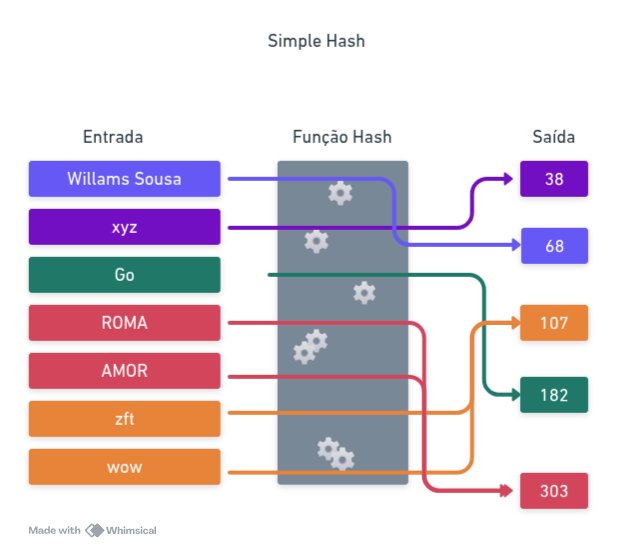

# Hashing e SHA-256

## Introdução
Funções hash são operações matemáticas que transformam uma entrada de qualquer tamanho em uma saída de tamanho fixo. Para uma mesma entrada, a saída gerada será sempre a mesma.

Uma das principais propriedades das funções hash é que a operação é irreversível, ou seja, não é possível obter a entrada original a partir da saída gerada.

Além disso, o tamanho da saída é sempre fixo, independentemente do tamanho da entrada. Isso significa que uma entrada curta e uma entrada muito longa geram um hash com a mesma quantidade de bits.

Embora seja esperado que entradas diferentes gerem hashes diferentes, existe a possibilidade de colisões, onde duas entradas distintas podem produzir o mesmo hash. A qualidade da função hash está diretamente ligada à sua capacidade de minimizar essas colisões.

Para começar, vamos criar uma função hash simples e passar por todos os pontos mencionados acima. Nossa função hash vai fazer o seguinte: dada uma entrada, somamos os valores ASCII da entrada e dessa soma obtemos o módulo 256, ou seja, teremos sempre um valor entre 0 e 255 não importando o tamanho da entrada. Acompanhe:

```go
package main

import (
    "fmt"
)

func simpleHash(in string) int {
    hash := 0
    for _, char := range in {
        hash += int(char)
    }
    return hash % 256
}

func main() {
	input1 := "willams sousa"
	input2 := "Go"
	input3 := "xyz"

    fmt.Printf("Hash de '%v':%v\n", input1, simpleHash(input1))
    fmt.Printf("Hash de '%v':%v\n", input2, simpleHash(input2))
    fmt.Printf("Hash de '%v':%v\n", input3, simpleHash(input3))
}
```
Nosso simpleHash tem apenas 256 saídas possíveis, mas pode processar infinitas entradas distintas. Isso inevitavelmente leva a colisões, pois, pelo Princípio da Pomba (Pigeonhole Principle), há mais entradas possíveis do que saídas distintas.


Por exemplo, todo palíndromo leva a colisões, pois a soma é uma operação comutativa, e a soma dos códigos ASCII dessas strings produz sempre o mesmo valor, independentemente da ordem dos caracteres. Mas esse problema não se restringe apenas a palíndromos. A string "wow" e "zft" também colidem, pois:

* "wow" → w=119, o=111, w=119 → 119 + 111 + 119 = 349
* "zft" → z=122, f=102, t=125 → 122 + 102 + 125 = 349

Isso demonstra que a ordem dos caracteres não é levada em conta, resultando em muitas colisões.

Propriedades de funções hash aplicadas ao simpleHash:

- [x] Determinística: Para a mesma entrada, sempre obtemos a mesma saída.
- [ ] Irreversível: Nossa função não é verdadeiramente irreversível, pois permite encontrar entradas compatíveis facilmente.
- [ ] Alta entropia e efeito avalanche: Pequenas mudanças na entrada não causam mudanças drásticas no hash.
- [ ] Resistência à pré-imagem: Se tivermos o valor H, podemos facilmente encontrar um X tal que hash(X) = H, devido ao baixo espaço de saída.
- [x] Saída de tamanho fixo: A saída sempre tem 256 valores possíveis, independentemente do tamanho da entrada.

Apesar disso, nosso algoritmo parece irreversível, mas pelos motivos errados! Devido à enorme incidência de colisões, não temos como saber qual foi a entrada exata que gerou determinada saída. Isso, porém, não é uma característica desejável em uma função hash criptográfica.




Podemos melhorar nossa função hash usando multiplicação por um fator primo melhorando a dispersão e reduzindo colisões triviais. P.ex:

```go
func betterHash(input string) int {
    hash := 0
    prime := 31 // Usar um número primo ajuda a dispersar os valores
	for i, char := range input {
		hash = hash*prime + int(char)
	}
	return hash & 0xFFFFFFFF // tamanho fixo (32 bits)
}
```

Contudo, o espaço da saída ainda é muito pequeno, estamos limitando a saída a 32 bits. Para grandes volumes de dados as colisões ainda serão inevitáveis e o algorítmo também não é resistente a pré-imagem. Além disso, pequenas mudanças na entrada não afetam significativamente a saída (efeito avalanche).

Esses exemplos foram um ótimo ponto de partida, mas a computação exigiu funções hash mais poderosas. Vamos analisar como os algoritmos evoluíram ao longo do tempo até chegarmos às soluções modernas, como o SHA-256.


## Famílias de Algorítmos Message Digest

### MD2

O primeiro algorítmo que vamos discutir é conhecido como MD2, o primeiro da família MD (Message Digest) e foi desenvolvido por Ronald Rivest em 1989. Ele foi projetado especificamente para computadores de 8 bits. Apesar de ter sido uma inovação importante, o MD2 se tornou obsoleto com o tempo devido a ataques criptográficos bem-sucedidos. Suas principais características eram:

* Tamanho da saída: 128 bits (16 bytes)
* Entrada de tamanho variável
* Projetado para máquinas de 8 bits
* Inseguro desde 2004 devido a ataques práticos
* Lento em hardware moderno devido à otimização para 8 bits

#### Como o MD2 Funciona?

A especificação do MD2 pode ser encontrada na RFC 1319. Esse algorítmo transforma qualquer entrada em um hash de 128bits. Ele faz isso seguindo 3 etapas principais:

1 - Padding

Para garantir que o tamanho da entrada seja um múltiplo de 16 bytes, adicionamos bytes de padding no final. A regra é a seguinte:

* se o tamanho da mensagem já for múltiplo de 16, adicionamos 16 bytes de 0x10.
* se falta N bytes para completar 16, adicionamos N bytes do valor N

Exemplo:

<pre>
Entrada original: [41 42 43] = "ABC"
Tamanho: 3 bytes
Padding necessário: 16 - 3 = 13 bytes
Resultado final: [41 42 43 0D 0D 0D 0D 0D 0D 0D 0D 0D 0D 0D 0D]
</pre>

2 - Checksum

O MD2 adiciona um checksum de 16 bytes, que é computado iterando sobre a mensagem e aplicando XOR com uma tabela de permutação.

Essa tabela de permutação S-box (256 valores) foi escolhida manualmente por Rivest e usada para misturar os dados.

A fórmula para calcular o checksum de 16 bytes é:

```
checksum[j] = checksum[j] XOR S(block[i] XOR checksum[j - 1])
```

Isso adiciona o efeito de difusão na mensagem antes da fase final.

3 - Processamento Principal

Agora pegamos a mensagem + checksum e a processamos usando uma permutação de 48 bytes, misturando os blocos de 16 bytes repetidamente.

O buffer inicial (48 bytes) é atualizado 18 vezes para fortalecer a resistência a colisões.

O MD2 não usa operações de bitwise complexas como rotação, apenas XOR e tabelas de substituição são usadas.


#### Implementação do MD2 em Go

A tabela S-box define os bytes que serão permutados internamente.

```go
package main

import (
	"fmt"
)

// Tabela de permutação S-box
var S = [256]byte{
	41, 46, 67, 201, 162, 216, 124, 1, 61, 54, 84, 161, 236, 240, 6, 19,
	98, 167, 5, 243, 192, 199, 115, 140, 152, 147, 43, 217, 188, 76, 130, 202,
	30, 155, 87, 60, 253, 212, 224, 22, 103, 66, 111, 24, 138, 23, 229, 18,
	// (o restante foi omitido por brevidade, consulte a RFC 1319)
}

func MD2(input []byte) [16]byte {
	// Parte 1: Padding
	paddingSize := 16 - (len(input) % 16)
	padding := make([]byte, paddingSize)
	for i := range padding {
		padding[i] = byte(paddingSize)
	}
	input = append(input, padding...)

	// Parte 2: Checksum
	var checksum [16]byte
	var L byte = 0
	for i := 0; i < len(input); i += 16 {
		for j := 0; j < 16; j++ {
			checksum[j] ^= S[input[i+j]^L]
			L = checksum[j]
		}
	}
	input = append(input, checksum[:]...)

	// Parte 3: Transformação Principal
	var X [48]byte
	
    for i := 0; i < len(input); i += 16 {
		
        // Copia bloco para X
		copy(X[16:32], input[i:i+16])
		for j := 0; j < 16; j++ {
			X[32+j] = X[16+j] ^ X[j]
		}
		var t byte = 0

		// 18 rounds de processamento
		for round := 0; round < 18; round++ {
			for j := 0; j < 48; j++ {
				X[j] ^= S[t]
				t = X[j]
			}
			t += byte(round)
		}
	}

	// O hash final está nos primeiros 16 bytes de X
	var hash [16]byte
	
    copy(hash[:], X[:16])
	
    return hash
}

func main() {
	data := []byte("Mensagem de teste")
	hash := MD2(data)
	fmt.Printf("MD2 Hash: %x\n", hash)
}
```


### MD4 - A Evolução do Message Digest


O MD4 (Message Digest 4) foi desenvolvido por Ronald Rivest em 1990 como uma melhoria do MD2, projetado especificamente para processadores de 32 bits. Ele introduziu um novo modelo de operação baseado em três rodadas de funções não lineares, tornando-o muito mais rápido que o MD2.

No entanto, o MD4 é extremamente fraco e foi quebrado rapidamente. Mesmo assim, sua estrutura inspirou diretamente o MD5 e SHA-1, servindo de base para os algoritmos de hash modernos e que veremos logo mais.

#### Como o MD4 Funciona?

A especificação do MD4 pode ser encontrada na RFC 1320. O algoritmo transforma qualquer entrada em um hash de 128 bits usando 3 rodadas de operações baseadas em soma modular e funções booleanas.

O MD4 segue 4 etapas principais:

1 - Padding

* O comprimento da mensagem é ajustado para que seja múltiplo de 512 bits (64 bytes).
* Um bit 1 é adicionado, seguido de zeros até que faltem 64 bits para completar um bloco.
* Os últimos 64 bits armazenam o tamanho original da mensagem (antes do padding)

Exemplo:

Se tivermos a mensagem "abc", que tem 24 bits (3 bytes), adicionamos:

```
01100001 01100010 01100011 10000000 00000000 ... (até completar 448 bits)

```
E então adicionamos os 64 bits finais contendo o tamanho da mensagem.

2 - Inicialização dos Registradores

MD4 usa quatro registradores de 32 bits, inicializados com valores fixos:

```
A = 0x67452301
B = 0xEFCDAB89
C = 0x98BADCFE
D = 0x10325476

```

Esses valores são inspirados na constante da raiz quadrada de números primos.

3 - Processamento em 3 Rodadas

A mensagem é dividida em blocos de 512 bits (64 bytes), e cada bloco passa por três rodadas de operações matemáticas:

3.1 - Função F (AND, OR, NOT)

```
F(X, Y, Z) = (X AND Y) OR (NOT X AND Z)

```

Essa função favore um dos valores (X) e ajuda na difusão.

3.2 - Função G (Majority Vote)

```
G(X, Y, Z) = (X AND Y) OR (X AND Z) OR (Y AND Z)

```

Utiliza uma "votação" entre os três valores.

3.3 - Função H (XOR)

```
H(X, Y, Z) = X XOR Y XOR Z

```

Mistura os bits de forma caótica.

Cada uma dessas funções é aplicada a cada bloco de 512 bits da mensagem, alterando os registradores A, B, C e D.

4 - Hash Final

Após todas as rodadas, os valores finais dos registradores A, B, C e D são concatenados para formar um hash de 128 bits (16 bytes).


#### Implementação do MD4 em Go

```go
package main

import (
	"encoding/binary"
	"fmt"
)

func leftRotate(x uint32, n uint) uint32 {
	return (x << n) | (x >> (32 - n))
}

// Funções F, G e H do MD4
func F(x, y, z uint32) uint32 { return (x & y) | (^x & z) }
func G(x, y, z uint32) uint32 { return (x & y) | (x & z) | (y & z) }
func H(x, y, z uint32) uint32 { return x ^ y ^ z }

// Transformação principal do MD4
func md4Transform(state *[4]uint32, block []byte) {
	var X [16]uint32
	for i := 0; i < 16; i++ {
		X[i] = binary.LittleEndian.Uint32(block[i*4:])
	}

	a, b, c, d := state[0], state[1], state[2], state[3]

	// Primeira rodada
	a = leftRotate(a+F(b, c, d)+X[0], 3)
	d = leftRotate(d+F(a, b, c)+X[1], 7)
	c = leftRotate(c+F(d, a, b)+X[2], 11)
	b = leftRotate(b+F(c, d, a)+X[3], 19)

	// Segunda rodada
	a = leftRotate(a+G(b, c, d)+X[0]+0x5A827999, 3)
	d = leftRotate(d+G(a, b, c)+X[4]+0x5A827999, 5)
	c = leftRotate(c+G(d, a, b)+X[8]+0x5A827999, 9)
	b = leftRotate(b+G(c, d, a)+X[12]+0x5A827999, 13)

	// Terceira rodada
	a = leftRotate(a+H(b, c, d)+X[0]+0x6ED9EBA1, 3)
	d = leftRotate(d+H(a, b, c)+X[8]+0x6ED9EBA1, 9)
	c = leftRotate(c+H(d, a, b)+X[4]+0x6ED9EBA1, 11)
	b = leftRotate(b+H(c, d, a)+X[12]+0x6ED9EBA1, 15)

	state[0] += a
	state[1] += b
	state[2] += c
	state[3] += d
}

func md4(input []byte) [16]byte {
	// Padding
	length := len(input)
	padding := []byte{0x80}
	for (len(input)+len(padding))%64 != 56 {
		padding = append(padding, 0x00)
	}

	lengthBits := make([]byte, 8)
	binary.LittleEndian.PutUint64(lengthBits, uint64(length*8))

	input = append(input, padding...)
	input = append(input, lengthBits...)

	// Inicializar registradores
	var state = [4]uint32{0x67452301, 0xEFCDAB89, 0x98BADCFE, 0x10325476}

	// Processar blocos de 512 bits (64 bytes)
	for i := 0; i < len(input); i += 64 {
		md4Transform(&state, input[i:i+64])
	}

	// Converter saída para 16 bytes
	var hash [16]byte
	for i := 0; i < 4; i++ {
		binary.LittleEndian.PutUint32(hash[i*4:], state[i])
	}
	return hash
}

func main() {
	data := []byte("Mensagem de teste")
	hash := md4(data)
	fmt.Printf("MD4 Hash: %x\n", hash)
}

```

#### Ataques Contra o MD4

O MD4 foi um grande avanço na época, mas também teve falhas graves de segurança. Aqui, exploramos os ataques mais relevantes que levaram à sua obsolescência.

1 - Ataque de Colisão (1995) - Hans Dobbertin

Em 1995, o criptógrafo Hans Dobbertin publicou um ataque prático contra o MD4, demonstrando que era possível encontrar colisões em alguns segundos.

Isso quebra a confiabilidade do algoritmo, pois qualquer atacante pode substituir um documento sem alterar seu hash.

Como Dobbertin quebrou o MD4?
Ele explorou fraquezas estruturais nas três rodadas do MD4, usando um método conhecido como differential cryptanalysis.

Ele encontrou colisões em menos de 1 minuto usando um computador comum da época!

2 - Ataque de Colisão Rápido (2007) - Wang et al.

Em 2007, Xiaoyun Wang, Hongbo Yu e Yiqun Lisa Yin aprimoraram os ataques de Dobbertin e conseguiram gerar colisões em tempo real.

3 - Ataque de Pré-imagem (2009)

Em 2009, pesquisadores mostraram que dado um hash MD4, era possível reconstruir uma entrada que produzia o mesmo valor.

Esse ataque é catastrófico para aplicações que dependem de integridade, como assinaturas digitais.

4 - Ataque a Senhas no NTLM (Windows)

O MD4 foi usado no NTLM (Microsoft Windows Authentication). Como os ataques de colisão e pré-imagem são rápidos, foi possível quebrar senhas NTLM em milissegundos.

#### Implementando um Ataque de Colisão Contra MD4 em Go

Vamos gerar duas mensagens diferentes com o mesmo hash.

```go
package main

import (
	"fmt"
)

// Simulação de colisão no MD4
func findCollision() {
	msg1 := []byte("Ataque123")
	msg2 := []byte("At4que123") // Alteração mínima

	hash1 := md4(msg1)
	hash2 := md4(msg2)

	fmt.Printf("Mensagem 1: %s\nHash 1: %x\n", msg1, hash1)
	fmt.Printf("Mensagem 2: %s\nHash 2: %x\n", msg2, hash2)

	if hash1 == hash2 {
		fmt.Println("Colisão encontrada!")
	} else {
		fmt.Println("Nenhuma colisão encontrada.")
	}
}

func main() {
	findCollision()
}

```


### MD5


